# 💳 Credit Card Fraud Detection using Supervised Learning

This project focuses on detecting fraudulent credit card transactions using supervised learning on an imbalanced dataset.  
The main goal is to compare different imbalance-handling strategies, evaluate models using **PR-AUC**, and choose a useful classification threshold based on both model performance and business value.

## 📌 Project Overview

Fraud detection is a classic **imbalanced classification** problem because fraud transactions are very rare compared to normal transactions.  
Because of that, **accuracy is not a reliable metric** here. This project gives more importance to:

- Precision
- Recall
- F1-score
- PR-AUC
- Threshold optimisation
- Cost-benefit analysis

To make local execution easier, a **50,000-row stratified sample** is used from the original dataset while preserving the fraud ratio.

## 🎯 Objectives

- Understand why fraud detection needs different evaluation metrics
- Perform EDA on the sampled data
- Apply feature engineering and preprocessing
- Compare multiple imbalance-handling strategies
- Train Logistic Regression, Random Forest, and XGBoost models
- Tune the best model and optimise the classification threshold
- Analyse business impact using confusion-matrix-based cost calculations
- Save the final trained model for reuse

## 📂 Project Files

- `FraudDetection_SupervisedLearning_SetC.ipynb` — complete notebook for the practical
- `creditcard.csv` — dataset used for training and evaluation
- `fraud_detection_model.pkl` — saved trained model
- `requirements.txt` — required Python libraries
- `summary_report.md` — short written summary of the project
- `screenshot/` — screenshots of key notebook outputs and plots

## 🧰 Tech Stack

- Python
- Pandas
- NumPy
- Matplotlib
- Scikit-learn
- Imbalanced-learn
- XGBoost
- Joblib
- Jupyter Notebook

## 🗂️ Workflow

1. Theory and problem framing
2. Dataset loading and exploratory data analysis
3. Feature engineering and scaling
4. Imbalance handling with original data, SMOTE, and random undersampling
5. Model building with Logistic Regression, Random Forest, and XGBoost
6. Threshold optimisation using Precision-Recall analysis
7. Business cost analysis
8. Model saving and final submission files

## 📊 Dataset Information

- Dataset: **Credit Card Fraud Detection**
- Source: [Kaggle Credit Card Fraud Dataset](https://www.kaggle.com/datasets/mlg-ulb/creditcardfraud)
- Target column: `Class`
  - `0` = Legitimate transaction
  - `1` = Fraud transaction
- The dataset is highly imbalanced, so special handling is required during training and evaluation.

## 🚀 How to Run

1. Keep all project files in the same folder.
2. Install the required libraries:

```bash
pip install -r requirements.txt
```

3. Open the notebook:

```bash
jupyter notebook
```

4. Run:

- `FraudDetection_SupervisedLearning_SetC.ipynb`

## 🏆 Model Summary

- Best overall model: **Tuned XGBoost**
- Main evaluation metric: **PR-AUC**
- Best threshold used in the report: **0.8805**
- The project also includes business analysis using:
  - Fraud value = **₹4500**
  - Investigation cost = **₹150**

## 💼 Business Insight

This project shows that the best ML model is not enough on its own.  
The threshold also matters because it changes:

- how many frauds are caught
- how many false alarms are created
- how much money is saved
- how much analyst review cost is added

That is why the final recommendation is based on both **model metrics** and **business value**.

## 🖼️ Screenshots

### 1. Exploratory Data Analysis

**Class distribution and amount distribution**

<p align="center">
  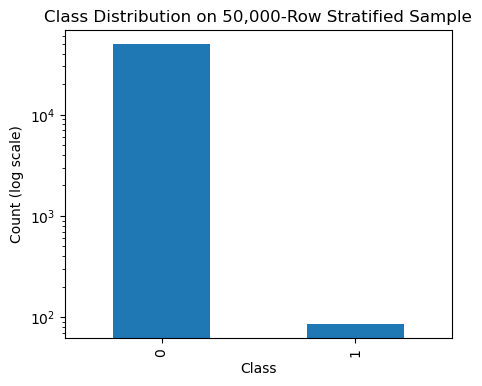
  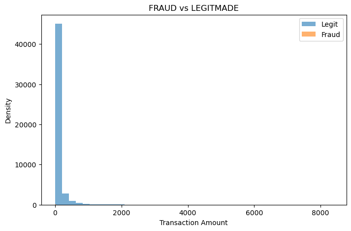
</p>

**Time distribution and correlation heatmap**

<p align="center">
  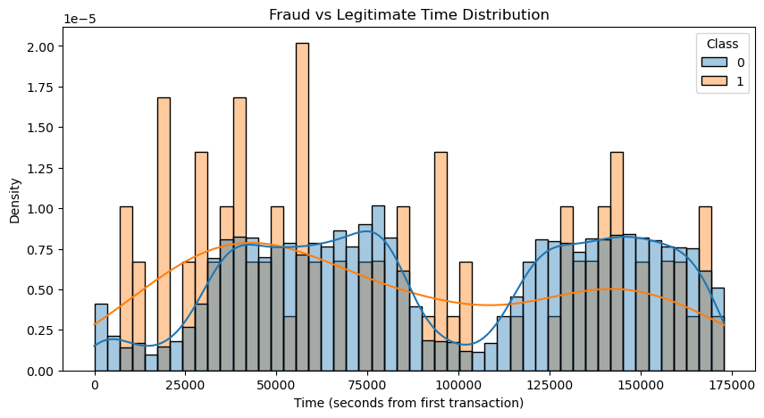
  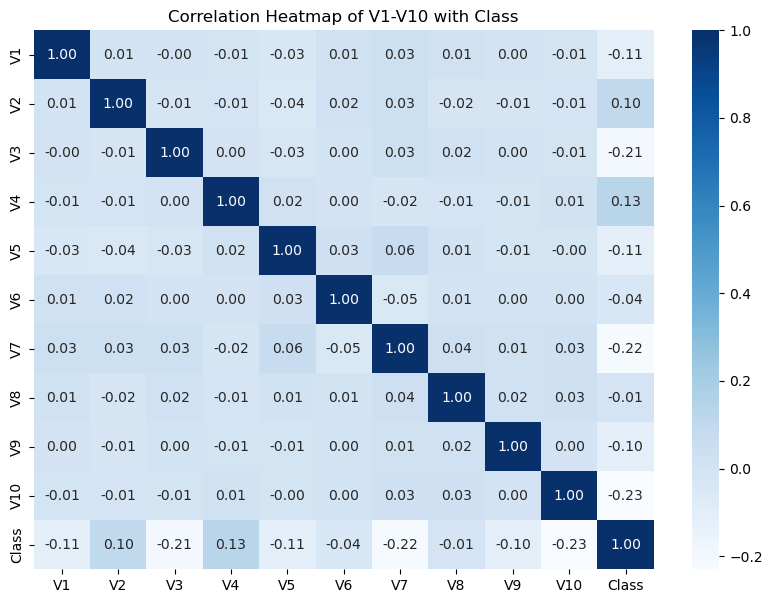
</p>

### 2. Model Evaluation

**Logistic Regression / strategy comparison and Random Forest PR curve**

<p align="center">
  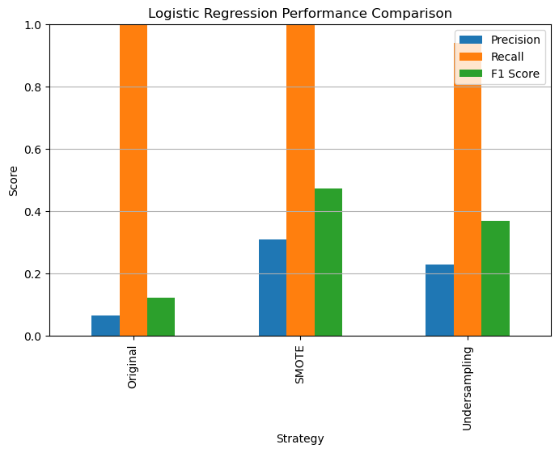
  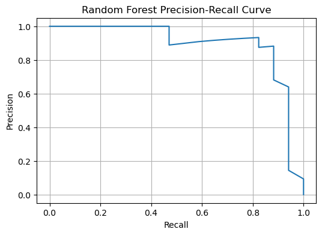
</p>

**XGBoost baseline and tuned model curves**

<p align="center">
  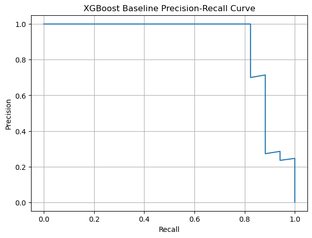
  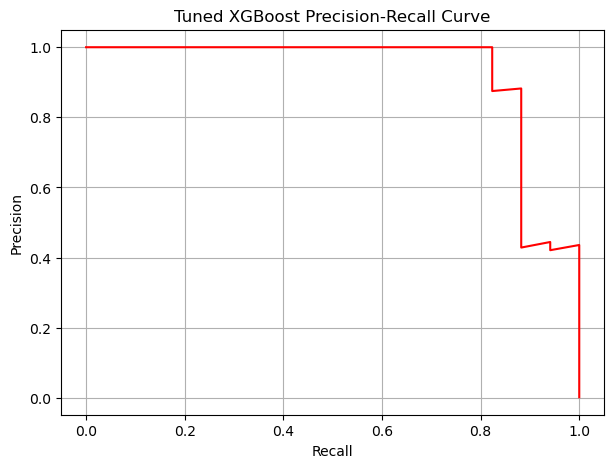
</p>

### 3. Threshold and Final Comparison

**Threshold tuning and final model comparison**

<p align="center">
  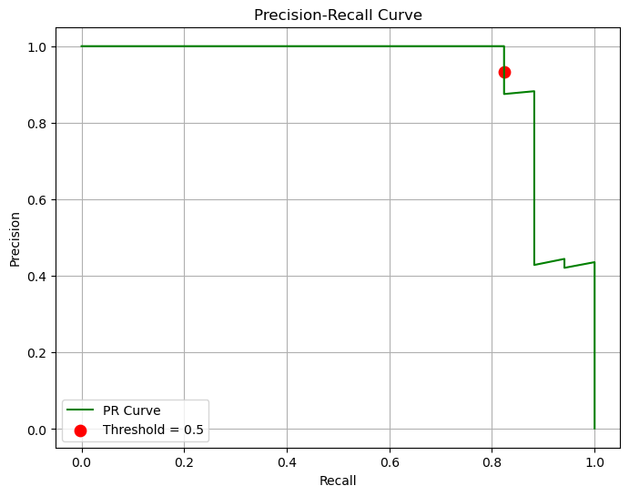
  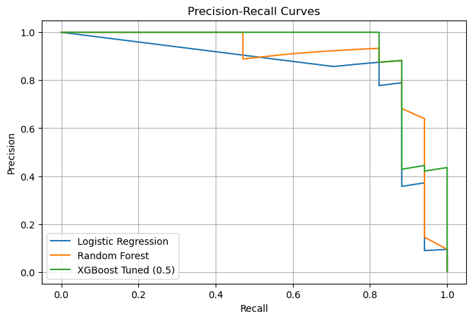
</p>

**Threshold analysis and top feature importance**

<p align="center">
  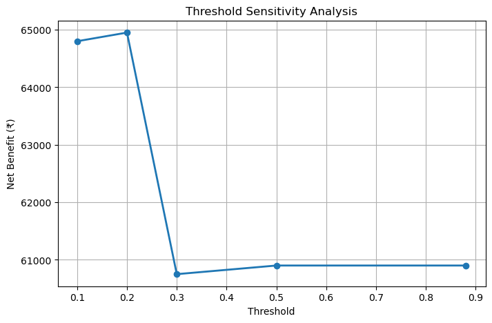
  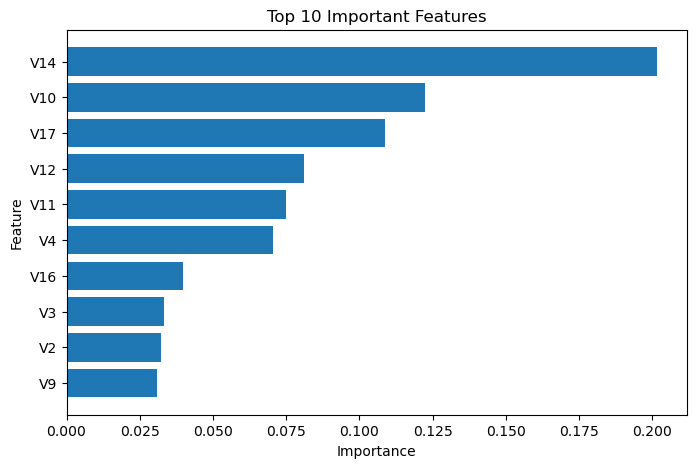
</p>

## 📁 Output Files

After running the notebook, the following main outputs are available:

- `fraud_detection_model.pkl`
- `summary_report.md`
- `requirements.txt`

## 🔮 Future Improvements

- Add real-time scoring for live transaction monitoring
- Use regular retraining with newly labelled fraud data
- Add model drift monitoring
- Add calibration and threshold updates over time
- Build a simple dashboard for fraud analyst review

## ✅ Conclusion

This project demonstrates a complete supervised learning workflow for fraud detection, starting from theory and EDA to model building, threshold tuning, and business analysis.  
The final notebook is practical, exam-oriented, and focused on solving the real problem of detecting fraud in an imbalanced dataset.
